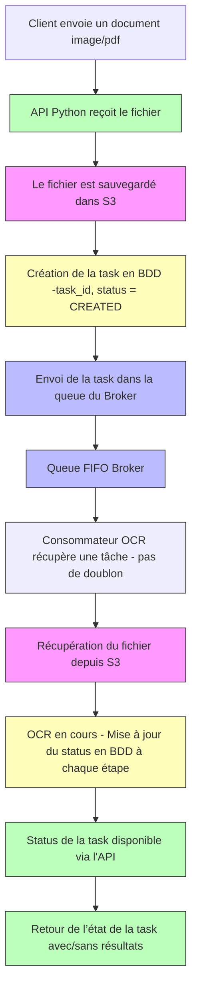
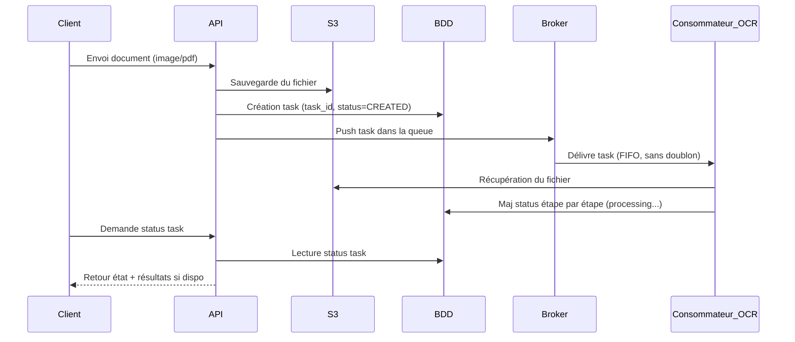

# OCR API

Une API permettant d'extraire du texte à partir de documents (PDF/images) à l’aide d’un pipeline asynchrone basé sur Redis, S3, et OCR.

## ℹ️ Fonctionnement

Le fonctionne de l'application est décrit dans les schémas suivant :

</img>

En termes d'ordre d'execution :



La diagramme de séquence est le suivant :



## 🛟 Contribution

Le projet utilise les prérequis suivant :

- Linux ou macOS
- `Docker` et `Docker Compose`
- `curl`, `make`

L'ensemble des commandes du projet est disponible avec la commande

```
make
```

### ⚙️ Installation

Installation des dépendances Python depuis `pyproject.toml` :

```bash
# with pip
pip install -r requirements.txt

# with docker
docker build -t ocr-api .
```

## Run
```bash
# with python
uvicorn main:app --reload --host 0.0.0.0 --port 5000

# with docker
docker run --rm -p 5000:5000 -v $PWD:/app ocr-api

#With docker compose
docker compose -f docker-compose.yaml up -d
```


then open `localhost:5000`

## Test
Use file `test.py` or write some code:
```python
import requests
import base64


with open("image_test.jpg", "rb") as image_file:
    encoded_data = base64.b64encode(image_file.read()).decode()

res = requests.post(
                    url='http://localhost:5000/',
                    json={"images": [encoded_data]}).json()
print("-------",res['msg'])
print(res['results'])
print("\n\n")
```

### With pytest
```
docker compose -f docker-compose.yaml run backend /bin/sh -c 'pip3 install pytest && pytest tests/ -s'
```

## Frontend

### Installation

Utilisation d'un Makefile pour exécuter les commandes ***(installation de `make` requis)***.


```sh
# Démarrer l'environnement de développement
make up-frontend

# Démarrer & mettre à jour les types
make generate-openapi
```
