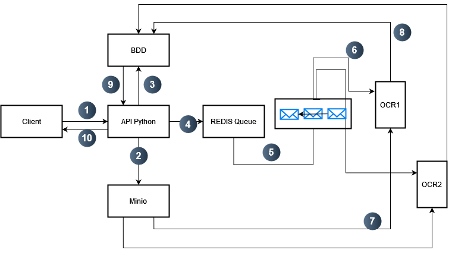
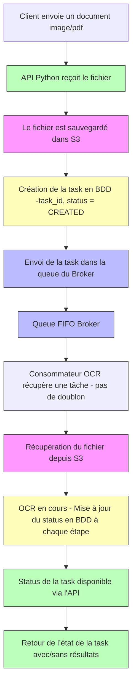
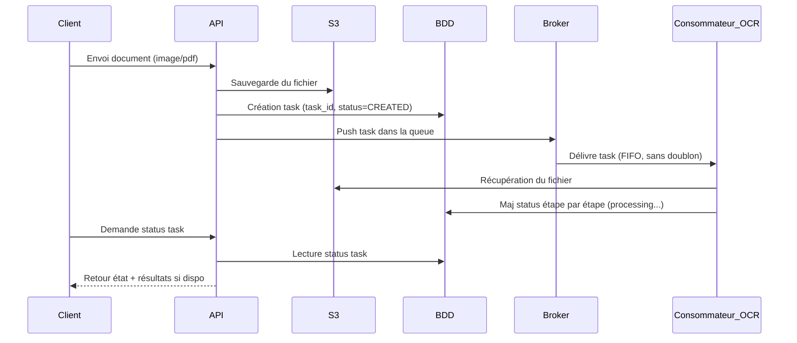

# OCR API

Une API permettant d'extraire du texte à partir de documents (PDF/images) à l’aide d’un pipeline asynchrone basé sur Redis, S3, et OCR.

## ℹ️ Fonctionnement

Le fonctionne de l'application est décrit dans les schémas suivant :

</img>

En termes d'ordre d'execution :



La diagramme de séquence est le suivant :



## 🛟 Contribution

Le projet utilise les prérequis suivant :

- Linux ou macOS
- `Docker` et `Docker Compose`
- `curl`, `make`

L'ensemble des commandes du projet est disponible avec la commande

```
make
```

### ⚙️ Installation

Installation des dépendances Python depuis `pyproject.toml` :

```bash
make install
```

Construire et démarrer les services nécessaires :

```bash
make up
```

Les dossiers contenants le code source sont montés automatiquements dans les conteneurs.

- Accès à l’API via : <http://localhost:5000>
- Accès à l'interface Flower via : <http://localhost:5555>

### 📏 Pratique de contribution

- Usage de `pre-commit` : les commits doivent suvire les règles imposés par le pre-commit config.
  - Conventionnal commit
  - Lint des fichiers
  - Pas de secrets
- Lorsqu'un changement dans les modèles `SQLAlchemy` est effectué, il faut lancer la commande `make upgrade-revision` afin d'ajouter une révision dans la migration
- Vérifier avant de `push`dans le remote que les tests fonctionne `make tests`
- L'intégration d'un nouveau modèle d'OCR se fait à partir de l'interface abstraite [`BaseModelPrediction`](#-intégration-via-basemodelpredictio)

### 📞 Utiliser l’API

#### Tester avec `curl`

```bash
curl -X 'POST' \
  'http://localhost:5000/?grayscale=false&return_image=false' \
  -H 'accept: application/json' \
  -H 'Content-Type: multipart/form-data' \
  -F 'file=@2109.10282v5.pdf;type=application/pdf'
```

#### Test de charge (stress test)

Utilisation de `locust` :

```bash
uv run locust -f stress-script/1-stress-test.py --host <URL>-u 5 -r 5 --run-time 2m
```

Avoir quelque stats sur les temps de process

```bash
uv run stress-script/2-process-stats.py
```

## 🧠 Modèles OCR disponibles

### 🔹 PaddleOCR

**PaddleOCR** est une suite d'outils OCR multilingues développée par Baidu, conçue pour être légère, précise et adaptée à des cas d’usage industriel.

- **PP-OCRv3**  version optimisée du système OCR ultra-léger PP-OCR, intégrant des améliorations telles que le module LK-PAN pour la détection de texte et le réseau SVTR pour la reconnaissance, offrant une précision accrue tout en maintenant une vitesse d'inférence élevé.

- **Fonctionnalités clés** :
  - Support de plus de 80 langues, y compris le français.
  - Détection de texte, classification de l'orientation et reconnaissance de text.
  - Modèles optimisés pour les appareils mobiles via Paddle-OCR

- **Utilisation** PaddleOCR fournit des modèles pré-entraînés pour une utilisation immédiate et permet également l'entraînement personnalisé sur des jeux de données spécifique.

### 🔹 Surya OC

**Surya OCR** est un outil OCR open-source axé sur l'analyse de documents complexes, offrant des performances comparables à celles des services cloud.

- **Fonctionnalités clés** :
- Support de plus de 90 langues pour l'OR.
- Détection de lignes de texte, analyse de la mise en page (tables, images, en-têtes), détection de l'ordre de lecture et reconnaissance de tableaux.
- Reconnaissance LaTeX pour les documents scientifiqus.

- **Utilisation**: Surya est particulièrement adapté pour les documents structurés tels que les articles scientifiques, les formulaires et les rapports complexes.

### 🔹 Intégration via `BaseModelPredictio`

Les deux modèles peuvent être intégrés en implémentant la classe abstraite `BaseModelPrediction`, garantissant une interface cohérente pour la prédiction :

```python
from abc import ABC, abstractmethod
from typing import Union, Any
import numpy as np
from PIL import Image

class BaseModelPrediction(ABC):
    @abstractmethod
    def batch_predict(
        self, images: list[Union[np.ndarray, Image.Image]], *args, **kwargs
    ) -> Any:
        pass
```

Cette structure permet de basculer facilement entre différents moteurs OCR ou d'en intégrer de nouveaux sans modifier le reste du code.
