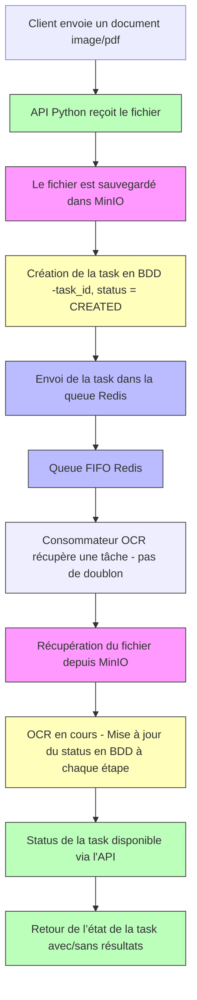
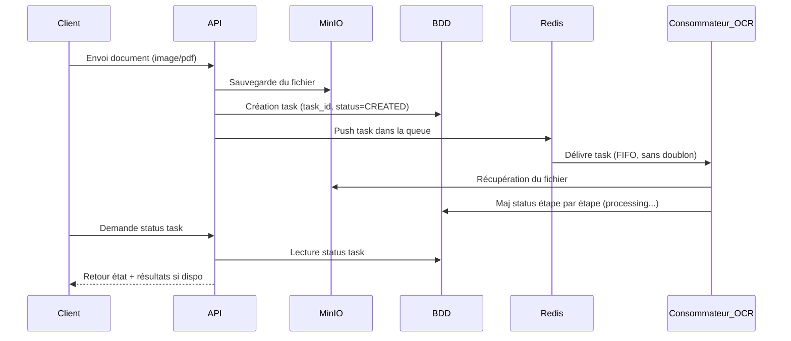

# OCR API

Une API permettant d'extraire du texte à partir de documents (PDF/images) à l’aide d’un pipeline asynchrone basé sur Redis, MinIO, et OCR.
---


##  Installation

### Avec `uv`

Installe les dépendances Python depuis pyproject.toml :

```bash
uv sync
```

### Avec Docker

Construire et démarrer les services nécessaires :

```bash
make build-ocr-backend     # Build de l'API OCR
make build-ocr-service     # Build du worker OCR
make up-env                # Lance MinIO et Redis
```

---

## Lancement de l’API

### En local avec Python

Démarrer le serveur Uvicorn en développement :

```bash
uv run uvicorn main:app --reload --host 0.0.0.0 --port 5000 --workers 2
```

### Avec Docker Compose

Démarrage complet via docker-compose :

```bash
docker compose -f docker-compose.yaml up -d
```

Accède ensuite à l'API via : [http://localhost:5000](http://localhost:5000)

---

## Tester l’API

### Tester avec `curl`

```bash
curl -X 'POST' \
  'http://localhost:5000/?grayscale=false&return_image=false' \
  -H 'accept: application/json' \
  -H 'Content-Type: multipart/form-data' \
  -F 'file=@2109.10282v5.pdf;type=application/pdf'
```

## Test de charge (stress test)

Utilisation de `locust` :

```bash
uv tool install locust --group stress-test
locust -f stress-test.py --host http://localhost:5000 \
  --headless -u 2 -r 10 --run-time 2m --csv results
```


Voici un résumé professionnel des modèles OCR que tu peux intégrer dans ton projet, en particulier PaddleOCR et Surya OCR, tous deux compatibles avec l'interface abstraite `BaseModelPrediction` que tu as définie.

---

## 🧠 Modèles OCR disponibles

### 🔹 PaddleOCR
**PaddleOCR** est une suite d'outils OCR multilingues développée par Baidu, conçue pour être légère, précise et adaptée à des cas d’usage industriel.

- **PP-OCRv3**  version optimisée du système OCR ultra-léger PP-OCR, intégrant des améliorations telles que le module LK-PAN pour la détection de texte et le réseau SVTR pour la reconnaissance, offrant une précision accrue tout en maintenant une vitesse d'inférence élevé.

- **Fonctionnalités clés** :
   - Support de plus de 80 langues, y compris le français.
   - Détection de texte, classification de l'orientation et reconnaissance de text.
   - Modèles optimisés pour les appareils mobiles via Paddle-OCR

- **Utilisation** PaddleOCR fournit des modèles pré-entraînés pour une utilisation immédiate et permet également l'entraînement personnalisé sur des jeux de données spécifique.

### 🔹 Surya OC

**Surya OCR** est un outil OCR open-source axé sur l'analyse de documents complexes, offrant des performances comparables à celles des services cloud.

- **Fonctionnalités clés** :
 - Support de plus de 90 langues pour l'OR.
 - Détection de lignes de texte, analyse de la mise en page (tables, images, en-têtes), détection de l'ordre de lecture et reconnaissance de tableaux.
 - Reconnaissance LaTeX pour les documents scientifiqus.

- **Utilisation**: Surya est particulièrement adapté pour les documents structurés tels que les articles scientifiques, les formulaires et les rapports complexes.

### 🔹 Intégration via `BaseModelPredictio`

Les deux modèles peuvent être intégrés dans ton pipeline OCR en implémentant la classe abstraite `BaseModelPrediction`, garantissant une interface cohérente pour la prédiction :


```python
from abc import ABC, abstractmethod
from typing import Union, Any
import numpy as np
from PIL import Image

class BaseModelPrediction(ABC):
    @abstractmethod
    def batch_predict(
        self, images: list[Union[np.ndarray, Image.Image]], *args, **kwargs
    ) -> Any:
        pass
```


Cette structure permet de basculer facilement entre différents moteurs OCR ou d'en intégrer de nouveaux sans modifier le reste du code.


## Diagramme execution
</img>




### Diagram Sequence

