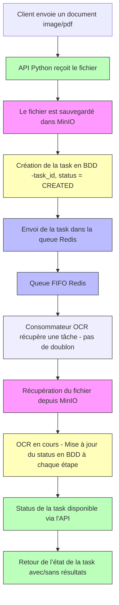
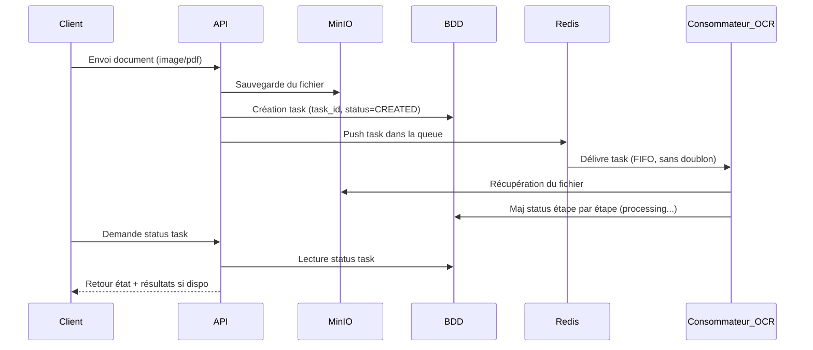

# OCR API

---


##  Installation

### Avec `uv`
```bash
uv sync
```

### Avec Docker
```bash
make build-ocr-backend
make build-ocr-service
make up-env # that let you run Minio and Redis
```

---

## Lancement de l’API

### En local avec Python
```bash
uv run uvicorn main:app --reload --host 0.0.0.0 --port 5000 --workers 2
```

### Avec Docker Compose
```bash
docker compose -f docker-compose.yaml up -d
```

Accède ensuite à l'API via : [http://localhost:5000](http://localhost:5000)

---

## Tester l’API
### Tester avec `curl`

```bash
curl -X 'POST' \
  'http://localhost:5000/?grayscale=false&return_image=false' \
  -H 'accept: application/json' \
  -H 'Content-Type: multipart/form-data' \
  -F 'file=@2109.10282v5.pdf;type=application/pdf'
```

## Test de charge (stress test)

Utilisation de `locust` :

```bash
uv add locust --group stress-test
uv run locust -f stress-test.py --host http://localhost:5000 \
  --headless -u 2 -r 10 --run-time 2m --csv results
```

## Diagramme execution 
</img>




### Diagram Sequence
