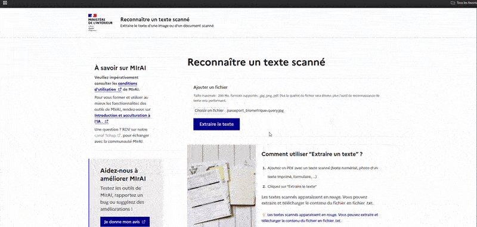
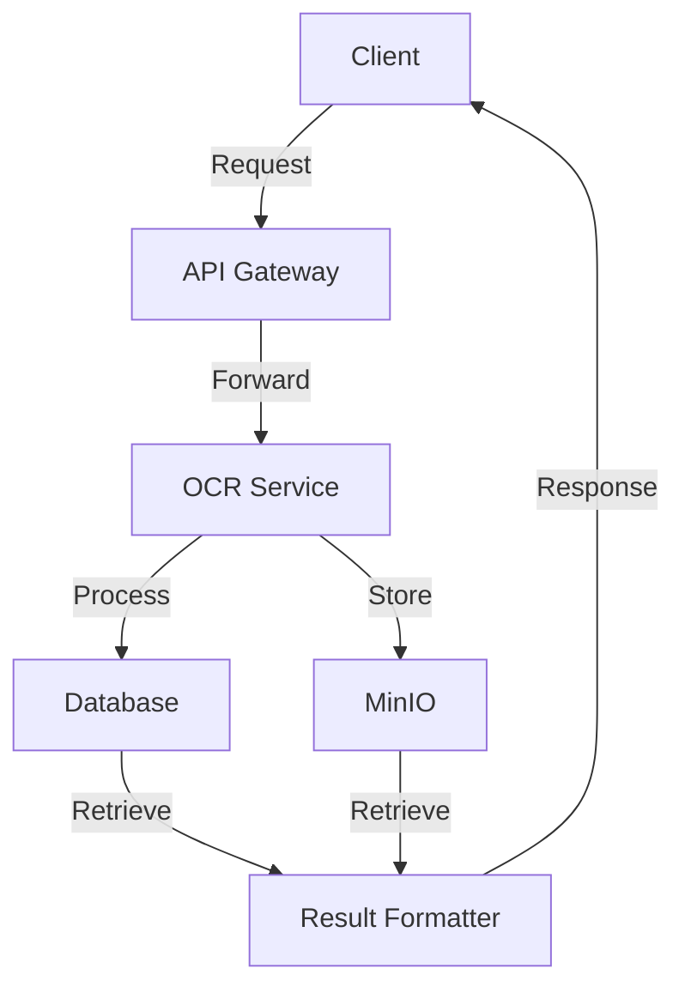

# OCR API
## Introduction

OCR API est une solution complète pour extraire du texte à partir de fichiers PDF ou d’images. Elle utilise des technologies avancées comme PaddleOCR et un pipeline asynchrone pour offrir des résultats rapides et précis. Cette API est conçue pour être facilement intégrée dans vos projets grâce à son SDK Python et ses fonctionnalités robustes.

---

## Table des matières

1. [OCR API](#ocr-api)
   1.1. [Introduction](#introduction)
   1.2. [Table des matières](#table-des-matières)
   1.3. Fonctionnalités disponibles
       1.3.1. [OCR](docs/ocr/README.md)
       1.3.2. [Classification](docs/classification/README.md)
       1.3.3. [Extractions d'entités](docs/extractions/README.md)
       1.3.4. [Templates](docs/templates/README.md)

2. [Installation](docs/server/INSTALL.md)
3. [Usage](docs/server/USAGE.md)

---

## Fonctionnement Asynchrone

Ce diagramme illustre le fonctionnement asynchrone de l'application, mettant en évidence les interactions entre les différents composants.

