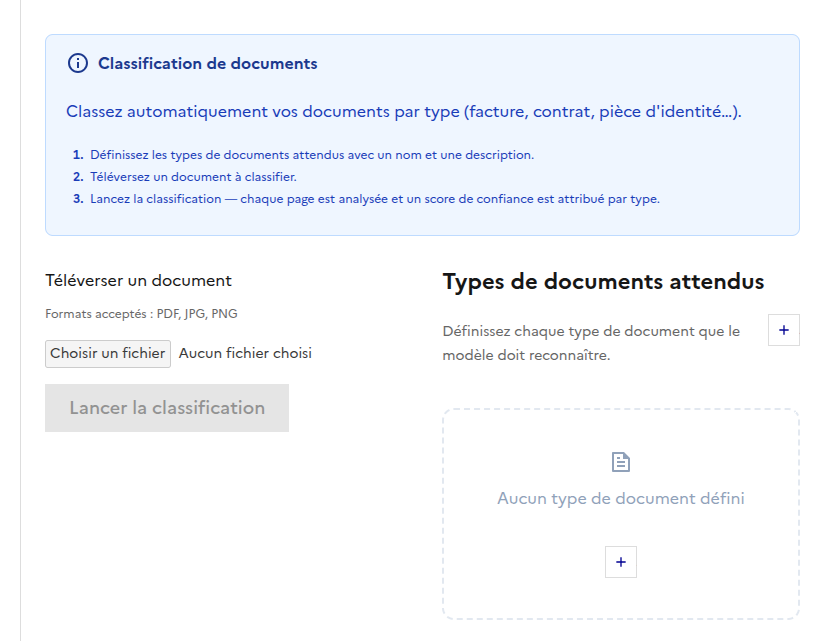
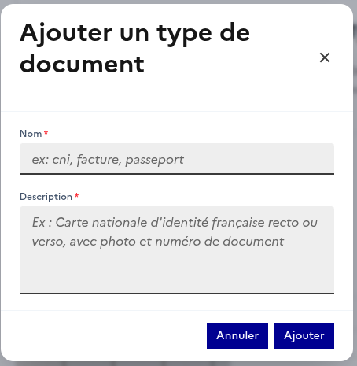

# Classification

## Introduction

La classification est une fonctionnalité clé de l'OCR API qui permet de catégoriser automatiquement les documents en fonction de leur contenu. Cette fonctionnalité repose sur la définition des classes par l'utilisateur et utilise uniquement le texte extrait des documents pour effectuer la classification. L'utilisation des images sera intégrée dans une version future.

  

---

  

- **Nom** : Champ permettant de définir le nom de la classification. Ce champ n'accepte pas de caractères spéciaux.
- **Description** : Champ utilisé pour fournir une description qui aide le modèle à prédire si une page correspond ou non à ce type de document. La classification est effectuée page par page, même pour les documents multi-pages.
- **Flexibilité** : Il est possible d'ajouter autant de classifications que nécessaire. Ces classifications seront visibles dans le panneau de droite de la vue principale de l'OCR.
