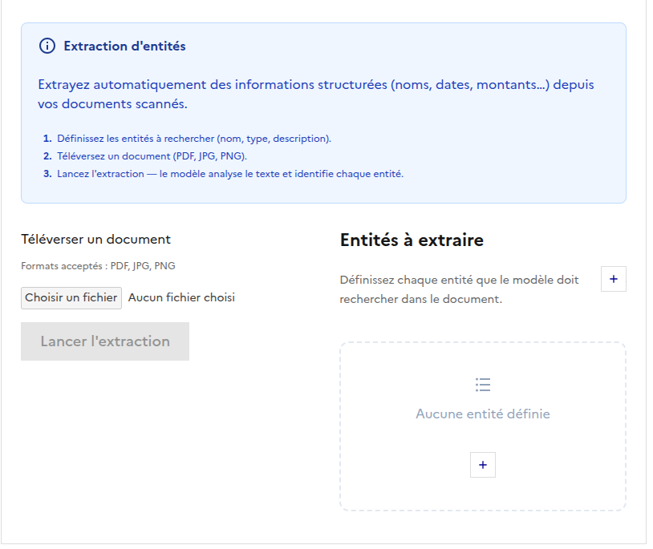
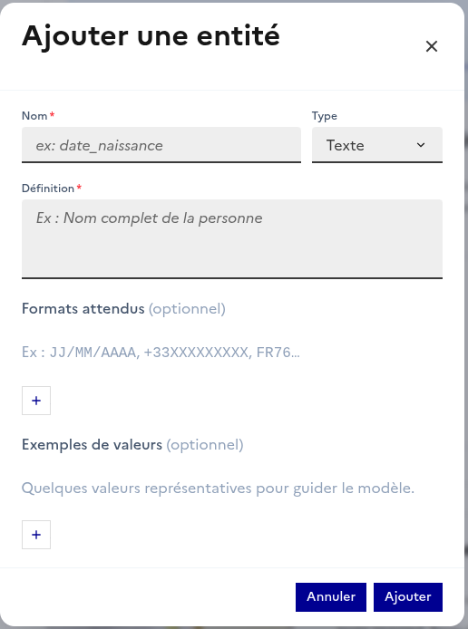

# Extractions d'entités

## Introduction

L'extraction d'entités est une fonctionnalité avancée de l'OCR API qui permet aux utilisateurs de définir des entités spécifiques à extraire à partir des documents. Les utilisateurs peuvent fournir des noms, des définitions, des exemples, et des formats pour guider le modèle dans l'extraction des entités pertinentes.

  

---

## Fonctionnalités

- **Définition des entités** : Les utilisateurs peuvent définir les noms et les définitions des entités à extraire.
- **Exemples et formats** : Possibilité de fournir des exemples et des formats pour améliorer la précision de l'extraction.
- **Encart des entités** : Les entités définies apparaissent dans un encart situé à droite de l'interface principale. Cet encart permet de sélectionner les entités directement dans l'image.
- **Barre de recherche** : Une barre de recherche est disponible au même endroit que pour l'OCR, permettant de rechercher rapidement des entités spécifiques.

  

