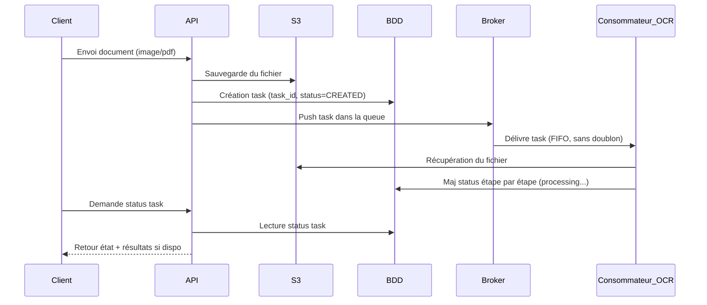

# OCR WORKFLOW

## ℹ️ Fonctionnement

Le diagramme de séquence est le suivant :

```mermaid
sequenceDiagram
    participant Client
    participant API
    participant S3
    participant BDD
    participant Broker
    participant Consommateur_OCR

    Client->>API: Envoi document (image/pdf)
    API->>S3: Sauvegarde du fichier
    API->>BDD: Création task (task_id, status=CREATED)
    API->>Broker: Push task dans la queue
    Broker->>Consommateur_OCR: Délivre task (FIFO, sans doublon)
    Consommateur_OCR->>S3: Récupération du fichier
    Consommateur_OCR->>BDD: Maj status étape par étape (processing...)
    Client->>API: Demande status task
    API->>BDD: Lecture status task
    API-->>Client: Retour état + résultats si dispo

```
