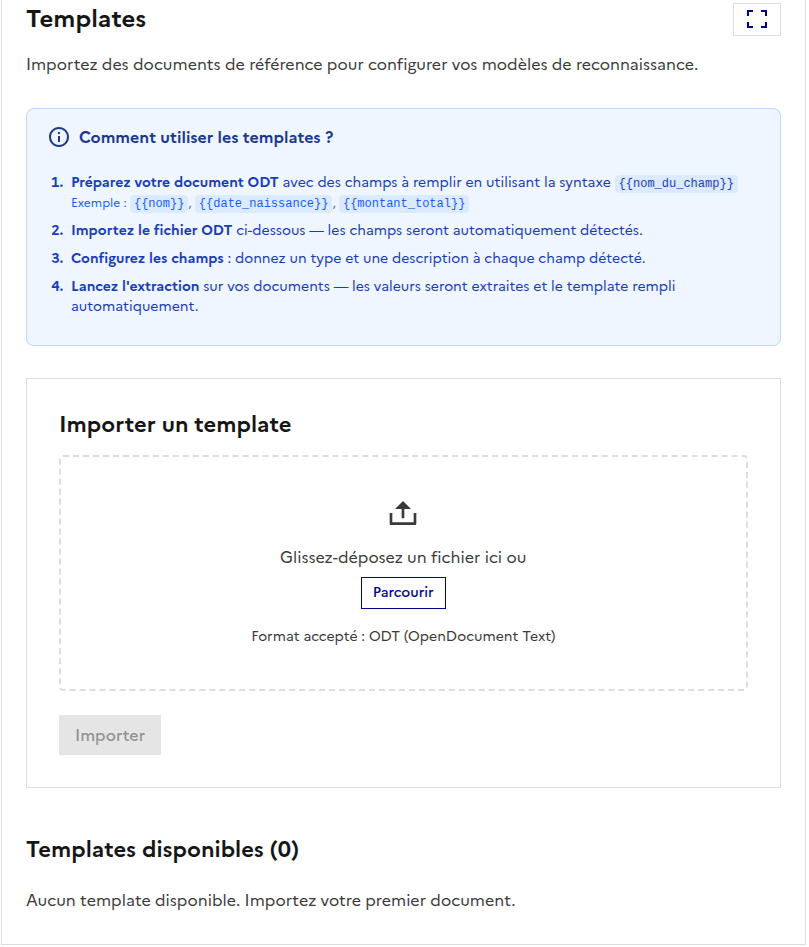

# Templates

## Introduction

La fonctionnalité de templates permet de générer des documents remplis automatiquement à partir de modèles fournis par l'utilisateur. Ces modèles doivent contenir des placeholders dans un format spécifique (par exemple, `{{name}}`).

  

---

## Fonctionnalités

- **Détection des placeholders** : Lorsqu'un utilisateur fournit un fichier template, le système détecte les placeholders définis correctement et ceux qui ne le sont pas.
- **Définition des placeholders** : Pour chaque placeholder détecté, l'utilisateur doit fournir une définition, similaire à la fonctionnalité d'extraction d'entités.
- **Enregistrement des templates** : Chaque template est enregistré pour un utilisateur spécifique, permettant une réutilisation future.
- **Remplissage automatique** : Pour un template donné et un document fourni, le modèle remplit automatiquement les placeholders avec les données correspondantes.
- **Lien de téléchargement** : Une fois le template rempli, un lien de téléchargement est généré pour récupérer le document final.

---